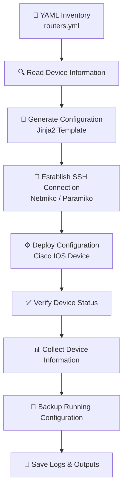

# Cisco Network Automation Framework
# 🚀 Cisco Network Automation Framework


A modular Python-based network automation project for Cisco IOS devices using **Paramiko**, **Netmiko**, **PyYAML**, and **Jinja2**. This repository documents my learning journey from basic SSH connectivity to building an integrated automation workflow with inventory management, configuration templating, automated deployment, device information collection, and configuration backups.

## Overview
---

# 📖 About the Project

The **Cisco Network Automation Framework** is a hands-on Python project developed to learn and apply modern network automation techniques for Cisco IOS devices.

The project demonstrates how repetitive network administration tasks can be automated using Python and industry-standard libraries such as **Paramiko**, **Netmiko**, **PyYAML**, and **Jinja2**. It progresses from establishing basic SSH connectivity to building a modular automation framework capable of managing multiple devices, deploying configurations, collecting device information, and creating automated configuration backups.

This repository also documents the learning process by including expected outputs, troubleshooting notes, and a final integrated automation script, making it both a practical reference and a portfolio project.
This project demonstrates end-to-end Cisco network automation using Python.
The framework covers SSH automation, device configuration, inventory management, configuration templating, and automated backups.

---

---
# 🌟 Project Highlights

- 🔹 Automated Cisco IOS device management using Python
- 🔹 SSH communication with Paramiko and Netmiko
- 🔹 Multi-device automation using YAML inventory
- 🔹 Configuration templating with Jinja2
- 🔹 Automated running-configuration backups
- 🔹 Device information collection
- 🔹 Modular project structure
- 🔹 Detailed troubleshooting documentation
- 🔹 Expected outputs for every lab
- 🔹 Final integrated automation framework


---

---

# ✨ Key Features

## 🔐 Secure SSH Connectivity
- Establish SSH connections to Cisco IOS devices using Paramiko and Netmiko.

## 🌐 Multi-Device Automation
- Manage multiple routers from a single YAML inventory file.

## 📝 Configuration Templating
- Generate reusable device configurations with Jinja2 templates.

## 💾 Automated Backups
- Save router running configurations for documentation and recovery.

## 📊 Device Information Collection
- Retrieve essential device details such as hostname, software version, and interface information.

## 📂 Organized Project Structure
- Separate folders for templates, inventories, backups, logs, expected outputs, and troubleshooting notes.

## 📈 Progressive Learning Approach
- The repository follows a structured learning path from basic SSH scripting to a complete automation workflow.

---
---

# 🛠️ Technologies Used

| Category | Technology | Purpose |
|----------|------------|---------|
| Programming Language | Python 3 | Automation scripting |
| SSH Library | Paramiko | Low-level SSH connectivity |
| Network Automation | Netmiko | Cisco IOS automation |
| Inventory Management | PyYAML | Multi-device inventory |
| Configuration Templates | Jinja2 | Dynamic configuration generation |
| Network Devices | Cisco IOS Routers | Automation targets |
| Network Simulator | GNS3 | Virtual network topology |
| Virtualization | VMware Workstation | Running the GNS3 VM |
| Development Environment | Ubuntu WSL | Python development and execution |
| Code Editor | Visual Studio Code | Development and debugging |
| Version Control | Git | Source code management |
| Repository Hosting | GitHub | Project hosting and collaboration |

---

# 🧰 Development Environment

The project was developed and tested using the following environment:

- **Operating System:** Ubuntu on Windows Subsystem for Linux (WSL)
- **Code Editor:** Visual Studio Code
- **Network Simulator:** GNS3
- **Virtual Machine:** GNS3 VM running on VMware Workstation
- **Network Devices:** Cisco IOS Routers
- **Python Version:** Python 3.x
- **Version Control:** Git & GitHub

# 📂 Project Structure

```text
Cisco_Network_Automation_Framework
│
├── backups/                      # Configuration backup files
├── docs/
│   └── screenshots/              # README images and screenshots
├── expected_outputs/             # Expected outputs for each lab
├── final_project/
│   └── automation.py             # Integrated automation project
├── inventory/
│   └── routers.yml               # Device inventory
├── logs/
│   └── automation.log            # Automation logs
├── templates/
│   └── cisco_config.j2           # Jinja2 configuration template
├── troubleshooting_notes/        # Troubleshooting and debugging notes
│
├── first_paramiko.py
├── paramiko_shell.py
├── paramiko_config.py
├── first_netmiko.py
├── send_command.py
├── send_config_set.py
├── multiple_devices.py
├── yaml_inventory.py
├── jinja2_template.py
├── router_backup.py
├── device_info.py
│
├── README.md
├── requirements.txt
└── .gitignore
```
```


# 🔄 Project Workflow

The automation framework follows a structured workflow that transforms device information into automated Cisco IOS configuration management.

## 🚀 Automation Pipeline




## 🔎 Workflow Stages

| Stage | Process | Technology Used |
|------|---------|----------------|
| 1️⃣ | Device Inventory Management | PyYAML |
| 2️⃣ | Configuration Generation | Jinja2 |
| 3️⃣ | Secure Device Connection | Paramiko / Netmiko |
| 4️⃣ | Configuration Deployment | Netmiko |
| 5️⃣ | Device Verification | Cisco IOS Commands |
| 6️⃣ | Backup & Logging | Python File Handling |

---

## 📌 Workflow Explanation

### 1️⃣ Device Inventory

Device details such as:

- Hostname
- IP Address
- Username
- Password
- Device Type

are stored in a structured YAML inventory file.

---

### 2️⃣ Configuration Generation

Jinja2 templates generate reusable Cisco IOS configuration files dynamically based on device requirements.

---

### 3️⃣ SSH Communication

Paramiko and Netmiko establish secure SSH sessions with Cisco routers for command execution and configuration changes.

---

### 4️⃣ Configuration Deployment

Generated configurations are automatically pushed to Cisco IOS devices.

---

### 5️⃣ Verification and Backup

The framework collects device information, verifies execution status, stores logs, and creates configuration backups.
---

---

# 📚 Learning Journey

This project was developed through a progressive learning approach:

```
Level 1
│
├── Paramiko
│   └── Basic SSH connectivity with Cisco devices
│
↓
Level 2
│
├── Netmiko
│   └── Cisco IOS command execution and configuration automation
│
↓
Level 3
│
├── PyYAML Inventory
│   └── Managing multiple devices using structured data
│
↓
Level 4
│
├── Jinja2 Templates
│   └── Dynamic configuration generation
│
↓
Level 5
│
└── Integrated Automation Framework
    └── Device automation, backups, logging and verification
```

The project demonstrates the transition from individual automation scripts to a complete network automation workflow.

---
---

# 🎯 Skills Demonstrated

Through this project, the following technical skills were developed:

- 🐍 Python programming and scripting
- 🌐 Cisco IOS network automation
- 🔐 SSH-based device communication
- ⚙️ Netmiko automation framework
- 🔑 Paramiko SSH programming
- 📄 YAML configuration management
- 📝 Jinja2 template-based automation
- 🐧 Linux command-line usage with Ubuntu WSL
- 🖥️ Network simulation using GNS3
- 💻 Virtual machine management using VMware Workstation
- 🔧 Debugging and troubleshooting network connectivity issues
- 📂 Git and GitHub workflow management

## Known Limitation

The project could not demonstrate live configuration deployment because of a WSL-to-GNS3 SSH connectivity issue.

The automation logic, project structure, and scripts were completed successfully.
