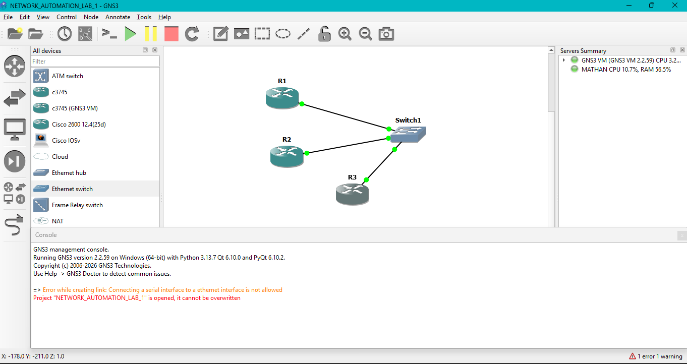
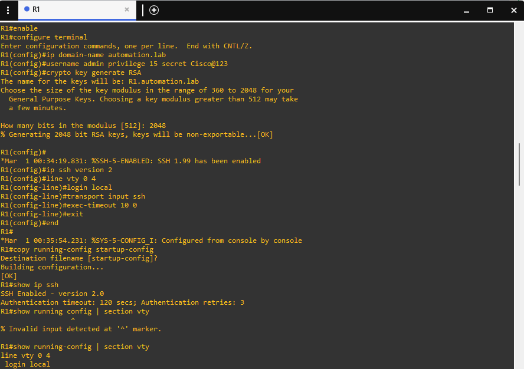
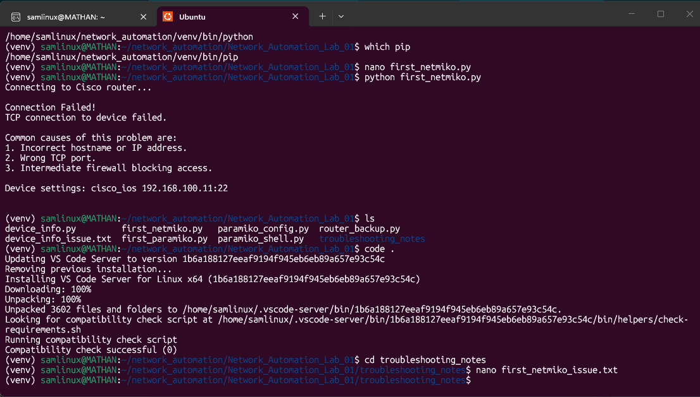
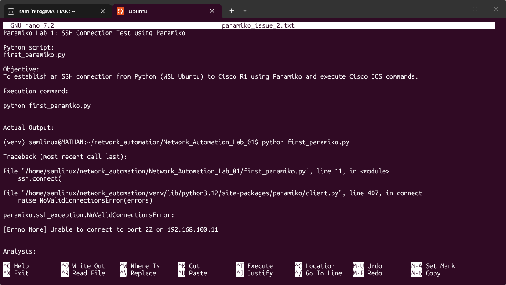
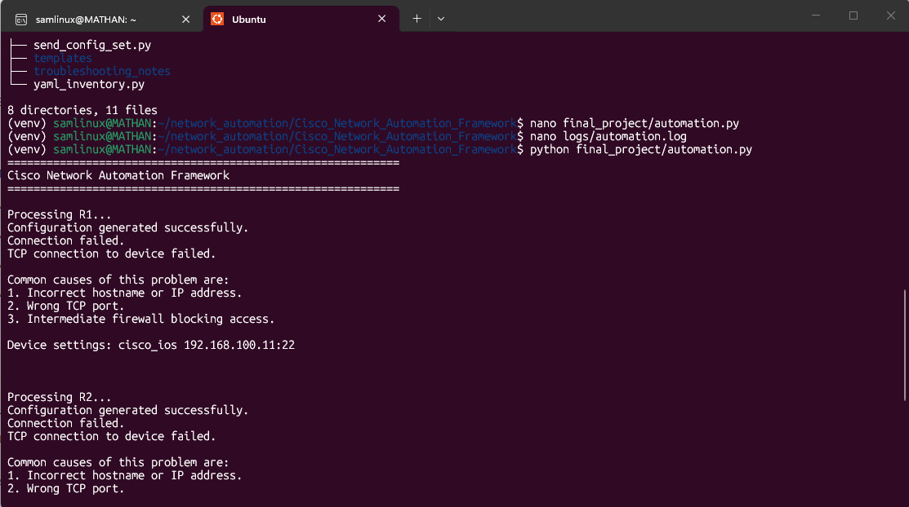
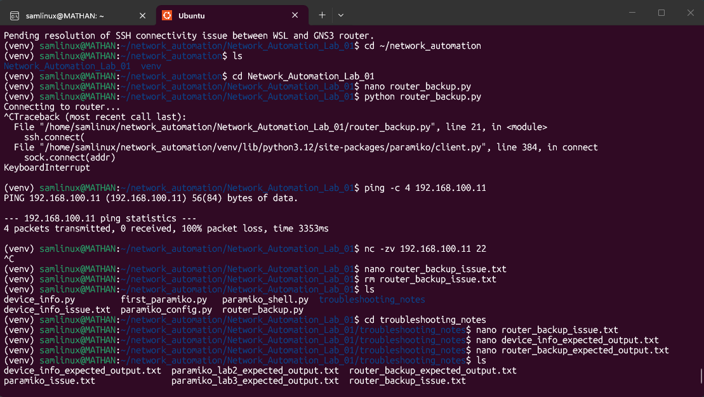

# Cisco Network Automation Framework
# 🚀 Cisco Network Automation Framework


A modular Python-based network automation project for Cisco IOS devices using **Paramiko**, **Netmiko**, **PyYAML**, and **Jinja2**. This repository documents my learning journey from basic SSH connectivity to building an integrated automation workflow with inventory management, configuration templating, automated deployment, device information collection, and configuration backups.

## Overview
---

# 📖 About the Project

The **Cisco Network Automation Framework** is a hands-on Python project developed to learn and apply modern network automation techniques for Cisco IOS devices.

The project demonstrates how repetitive network administration tasks can be automated using Python and industry-standard libraries such as **Paramiko**, **Netmiko**, **PyYAML**, and **Jinja2**. It progresses from establishing basic SSH connectivity to building a modular automation framework capable of managing multiple devices, deploying configurations, collecting device information, and creating automated configuration backups.

This repository also documents the learning process by including expected outputs, troubleshooting notes, and a final integrated automation script, making it both a practical reference and a portfolio project.
This project demonstrates end-to-end Cisco network automation using Python.
The framework covers SSH automation, device configuration, inventory management, configuration templating, and automated backups.

---

---
# 🌟 Project Highlights

- 🔹 Automated Cisco IOS device management using Python
- 🔹 SSH communication with Paramiko and Netmiko
- 🔹 Multi-device automation using YAML inventory
- 🔹 Configuration templating with Jinja2
- 🔹 Automated running-configuration backups
- 🔹 Device information collection
- 🔹 Modular project structure
- 🔹 Detailed troubleshooting documentation
- 🔹 Expected outputs for every lab
- 🔹 Final integrated automation framework


---

---

# ✨ Key Features

## 🔐 Secure SSH Connectivity
- Establish SSH connections to Cisco IOS devices using Paramiko and Netmiko.

## 🌐 Multi-Device Automation
- Manage multiple routers from a single YAML inventory file.

## 📝 Configuration Templating
- Generate reusable device configurations with Jinja2 templates.

## 💾 Automated Backups
- Save router running configurations for documentation and recovery.

## 📊 Device Information Collection
- Retrieve essential device details such as hostname, software version, and interface information.

## 📂 Organized Project Structure
- Separate folders for templates, inventories, backups, logs, expected outputs, and troubleshooting notes.

## 📈 Progressive Learning Approach
- The repository follows a structured learning path from basic SSH scripting to a complete automation workflow.

---
---

# 🛠️ Technologies Used

| Category | Technology | Purpose |
|----------|------------|---------|
| Programming Language | Python 3 | Automation scripting |
| SSH Library | Paramiko | Low-level SSH connectivity |
| Network Automation | Netmiko | Cisco IOS automation |
| Inventory Management | PyYAML | Multi-device inventory |
| Configuration Templates | Jinja2 | Dynamic configuration generation |
| Network Devices | Cisco IOS Routers | Automation targets |
| Network Simulator | GNS3 | Virtual network topology |
| Virtualization | VMware Workstation | Running the GNS3 VM |
| Development Environment | Ubuntu WSL | Python development and execution |
| Code Editor | Visual Studio Code | Development and debugging |
| Version Control | Git | Source code management |
| Repository Hosting | GitHub | Project hosting and collaboration |

---

# 🧰 Development Environment

The project was developed and tested using the following environment:

- **Operating System:** Ubuntu on Windows Subsystem for Linux (WSL)
- **Code Editor:** Visual Studio Code
- **Network Simulator:** GNS3
- **Virtual Machine:** GNS3 VM running on VMware Workstation
- **Network Devices:** Cisco IOS Routers
- **Python Version:** Python 3.x
- **Version Control:** Git & GitHub

# 📂 Project Structure

```text
Cisco_Network_Automation_Framework
│
├── backups/                      # Configuration backup files
├── docs/
│   └── screenshots/              # README images and screenshots
├── expected_outputs/             # Expected outputs for each lab
├── final_project/
│   └── automation.py             # Integrated automation project
├── inventory/
│   └── routers.yml               # Device inventory
├── logs/
│   └── automation.log            # Automation logs
├── templates/
│   └── cisco_config.j2           # Jinja2 configuration template
├── troubleshooting_notes/        # Troubleshooting and debugging notes
│
├── first_paramiko.py
├── paramiko_shell.py
├── paramiko_config.py
├── first_netmiko.py
├── send_command.py
├── send_config_set.py
├── multiple_devices.py
├── yaml_inventory.py
├── jinja2_template.py
├── router_backup.py
├── device_info.py
│
├── README.md
├── requirements.txt
└── .gitignore
```

---

# ⚙️ Installation

Follow these steps to set up the Cisco Network Automation Framework locally.

## 1. Clone the Repository

```bash
git clone https://github.com/SASWATIMATHAN/Cisco_Network_Automation_Framework.git
```

Navigate into the project directory:

```bash
cd Cisco_Network_Automation_Framework
```

---

## 2. Create a Python Virtual Environment

Create a virtual environment:

```bash
python3 -m venv venv
```

Activate it:

### Ubuntu / Linux / WSL

```bash
source venv/bin/activate
```

### Windows

```bash
venv\Scripts\activate
```

---

## 3. Install Dependencies

Install the required Python libraries:

```bash
pip install -r requirements.txt
```

Required packages include:

- Netmiko
- Paramiko
- PyYAML
- Jinja2

---

## 4. Configure Device Inventory

Update the device information in:

```
inventory/routers.yml
```

Example:

```yaml
router1:
  device_type: cisco_ios
  host: 192.168.1.1
  username: admin
  password: password
```

---

## 5. Verify Network Connectivity

Ensure:

- Cisco devices are reachable
- SSH is enabled
- Correct IP addresses are configured
- GNS3 topology is running (if using simulation)

---

# ▶️ Usage

The project contains multiple automation modules demonstrating different stages of network automation.

## Basic SSH Connectivity

### Paramiko Example

```bash
python3 first_paramiko.py
```

Establishes a basic SSH connection with a Cisco IOS device.

---

## Cisco Command Automation

### Netmiko Command Execution

```bash
python3 send_command.py
```

Executes Cisco IOS show commands and retrieves device output.

---

## Configuration Deployment

```bash
python3 send_config_set.py
```

Sends configuration commands to Cisco devices.

---

## Multi-Device Automation

```bash
python3 multiple_devices.py
```

Automates tasks across multiple network devices.

---

## YAML Inventory Automation

```bash
python3 yaml_inventory.py
```

Reads device information from the YAML inventory file.

---

## Jinja2 Configuration Templates

```bash
python3 jinja2_template.py
```

Generates dynamic Cisco configurations using templates.

---

## Automated Backup

```bash
python3 router_backup.py
```

Collects and stores running configuration backups.

---

## Final Integrated Automation Framework

```bash
python3 final_project/automation.py
```

Runs the complete automation workflow combining inventory, templates, device communication, backups, and logging.

# 🔄 Project Workflow

The automation framework follows a structured workflow that transforms device information into automated Cisco IOS configuration management.

## 🚀 Automation Pipeline

| **Step** | **Process** | **Description** |
|----------|-------------|-----------------|
| **1️⃣ Inventory Definition** | 📄 YAML Inventory (`routers.yml`) | Stores Cisco device details such as IP address, username, password, and device type. |
| **2️⃣ Device Information Reading** | 🔍 Parse Device Data | Python scripts read and process device information from the YAML inventory file. |
| **3️⃣ Configuration Generation** | 📝 Jinja2 Template Rendering | Dynamic Cisco IOS configuration files are generated using Jinja2 templates. |
| **4️⃣ Secure Device Connection** | 🔐 SSH Connection (Netmiko / Paramiko) | Establishes secure SSH communication with Cisco IOS devices. |
| **5️⃣ Configuration Deployment** | ⚙️ Cisco IOS Configuration Push | Automated configuration commands are deployed to network devices. |
| **6️⃣ Device Verification** | ✅ Status Validation | Checks device connectivity and verifies successful configuration deployment. |
| **7️⃣ Information Collection** | 📊 Device Data Gathering | Collects interface details, routing information, and device status. |
| **8️⃣ Configuration Backup** | 💾 Running Configuration Backup | Saves the current running configuration for future recovery. |
| **9️⃣ Logging & Reporting** | 📁 Output Management | Stores execution logs, reports, and automation results. |


## 🔎 Workflow Stages

| Stage | Process | Technology Used |
|------|---------|----------------|
| 1️⃣ | Device Inventory Management | PyYAML |
| 2️⃣ | Configuration Generation | Jinja2 |
| 3️⃣ | Secure Device Connection | Paramiko / Netmiko |
| 4️⃣ | Configuration Deployment | Netmiko |
| 5️⃣ | Device Verification | Cisco IOS Commands |
| 6️⃣ | Backup & Logging | Python File Handling |

---

## 📌 Workflow Explanation

### 1️⃣ Device Inventory

Device details such as:

- Hostname
- IP Address
- Username
- Password
- Device Type

are stored in a structured YAML inventory file.

---

### 2️⃣ Configuration Generation

Jinja2 templates generate reusable Cisco IOS configuration files dynamically based on device requirements.

---

### 3️⃣ SSH Communication

Paramiko and Netmiko establish secure SSH sessions with Cisco routers for command execution and configuration changes.

---

### 4️⃣ Configuration Deployment

Generated configurations are automatically pushed to Cisco IOS devices.

---

### 5️⃣ Verification and Backup

The framework collects device information, verifies execution status, stores logs, and creates configuration backups.
---

---
# 📸 Screenshots & Demonstration

## 🌐 GNS3 Network Topology

The automation framework was tested using a Cisco IOS topology created in GNS3.

The topology includes:
- Cisco IOS routers configured for SSH access
- Management IP addressing
- Remote automation from Ubuntu WSL environment
- Automated configuration deployment and verification

## 🌐 GNS3 Network Topology

The automation framework was tested on a multi-router Cisco IOS topology created in GNS3.



---

## 🔐 SSH Configuration

Cisco IOS devices were configured for secure SSH access before automation.



## 🔐 Netmiko Automation Output

Netmiko was used to establish SSH sessions with Cisco IOS devices and automate configuration tasks.

## ⚡ Netmiko + Jinja2 + PyYAML

The framework uses YAML inventory files, Jinja2 templates, and Netmiko to automate Cisco IOS configuration deployment.



Example tasks:
- Device connection verification
- Configuration deployment
- Command execution
- Output collection

---

## 🐍 Paramiko Automation Output

Paramiko was explored for low-level SSH automation and configuration backup operations.

## 🐍 Paramiko Automation

Paramiko was used to establish SSH sessions, execute commands, and perform configuration backups.



Implemented tasks:
- SSH session handling
- Command execution
- Running configuration backup
- Error handling and debugging

## 🚀 Final Project Execution

The complete automation workflow integrates inventory management, template rendering, SSH connectivity, configuration deployment, verification, and reporting.



## 🛠️ Troubleshooting

Throughout development, various networking and SSH connectivity issues were documented and resolved.



> 📁 **Complete laboratory documentation and additional screenshots are available in the [`docs/screenshots`](docs/screenshots) directory.**

# 📚 Learning Journey

This project was developed through a progressive learning approach:

```
Level 1
│
├── Paramiko
│   └── Basic SSH connectivity with Cisco devices
│
↓
Level 2
│
├── Netmiko
│   └── Cisco IOS command execution and configuration automation
│
↓
Level 3
│
├── PyYAML Inventory
│   └── Managing multiple devices using structured data
│
↓
Level 4
│
├── Jinja2 Templates
│   └── Dynamic configuration generation
│
↓
Level 5
│
└── Integrated Automation Framework
    └── Device automation, backups, logging and verification
```

The project demonstrates the transition from individual automation scripts to a complete network automation workflow.

---
---

# 🎯 Skills Demonstrated

Through this project, the following technical skills were developed:

- 🐍 Python programming and scripting
- 🌐 Cisco IOS network automation
- 🔐 SSH-based device communication
- ⚙️ Netmiko automation framework
- 🔑 Paramiko SSH programming
- 📄 YAML configuration management
- 📝 Jinja2 template-based automation
- 🐧 Linux command-line usage with Ubuntu WSL
- 🖥️ Network simulation using GNS3
- 💻 Virtual machine management using VMware Workstation
- 🔧 Debugging and troubleshooting network connectivity issues
- 📂 Git and GitHub workflow management

# 🛠️ Troubleshooting & Challenges

During the development of this project, several networking and automation challenges were encountered and resolved through systematic debugging.

| **Challenge** | **Problem Observed** | **Solution / Learning** |
|--------------|---------------------|------------------------|
| 🔌 SSH Connectivity Issues | Unable to establish SSH connection from automation scripts to Cisco devices | Verified SSH configuration, device reachability, firewall settings, and management connectivity. |
| 🌐 GNS3 and WSL Networking | Communication between GNS3 devices and Ubuntu WSL environment was challenging | Analysed network interfaces, VM connectivity, and adapted the testing approach. |
| 🐧 WSL Environment Setup | Required separate Linux environment for automation development | Configured Ubuntu WSL with Python virtual environment and required libraries. |
| 📦 Python Dependency Management | Multiple automation libraries were required | Installed and managed Netmiko, Paramiko, PyYAML, and Jinja2 inside a virtual environment. |
| 🔐 Paramiko Connection Errors | Encountered SSH connection failures during automation testing | Debugged IP addressing, SSH availability, router configuration, and port accessibility. |
| 📄 Configuration Backup Testing | Backup script required reliable device communication | Developed structured scripts for configuration collection and file storage. |

## Key Learning Outcomes

Through troubleshooting, this project improved understanding of:

- Cisco IOS SSH configuration
- Network connectivity debugging
- Linux networking environment
- Python-based network automation
- Error analysis and documentation
- Real-world automation workflow

# 🚀 Future Roadmap

Future improvements planned for this automation framework:

| **Feature** | **Planned Enhancement** |
|------------|------------------------|
| 🤖 Ansible Integration | Extend automation using Ansible playbooks for multi-device management. |
| ☁️ Cloud Deployment | Deploy automation workflows using AWS cloud infrastructure. |
| 📊 Monitoring Dashboard | Create a web dashboard for device status and automation reports. |
| 🔄 CI/CD Integration | Automate testing and deployment using GitHub Actions. |
| 🔐 Improved Security | Implement encrypted credential management using Vault solutions. |
| 📡 Multi-Vendor Support | Extend support beyond Cisco IOS devices. |


## Known Limitation

The project could not demonstrate live configuration deployment because of a WSL-to-GNS3 SSH connectivity issue.

The automation logic, project structure, and scripts were completed successfully.

# 👩‍💻 Author

**Saswati Anupama Mathan**

M.Tech ECE (Communication)  
Interested in:
- Network Automation
- Python Programming
- Embedded Systems
- Communication Systems
- Cloud & DevOps Technologies

This project represents my hands-on learning journey in Python-based network automation, Cisco device management, and troubleshooting real networking environments.

⭐ If you find this project useful, feel free to explore and connect.

# 📜 License

This project is licensed under the MIT License. See the [LICENSE](LICENSE) file for details.